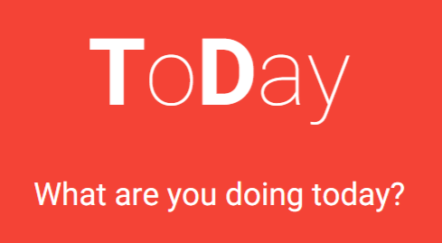

ToDay v0.0.1 - The beginnings of a simple but powerful daily organizer.

## Authors

* Michael Markman
* Brian Lai
* Matt Wolff

## Features (0.0.1)

* Responsive design, works for web and for mobile.
* Sortable lists, drag and drop each task entry up and down the list.
* Each task can be filled with a description and 3 sub-tasks.
* Simple and straightforward user interface.

Using Google's Material Design as a guide, the focus was on simplicity and usability. This is also reflected in the intended purpose of the application.
ToDay is a planner for the current day. It's the things you need to do today. Not yesterday (list will clear every day) or tomorrow, but today.
We want the user to stay focused on their current day and on accomplishing all that they set out to do. Day by day, task by task.

## Future (0.0.X)

* User Accounts
* Gamification, 
* Data collection and Analysis, 
* Android/iOS apps, 
* Smart Suggestions, 
* Speech to Text interactions,
* ...TBA

## Build & development

1. Run 'npm install'
2. Run 'bower install'
3. Run 'grunt serve'

## Testing

Running `grunt test` will run the unit tests with karma.
